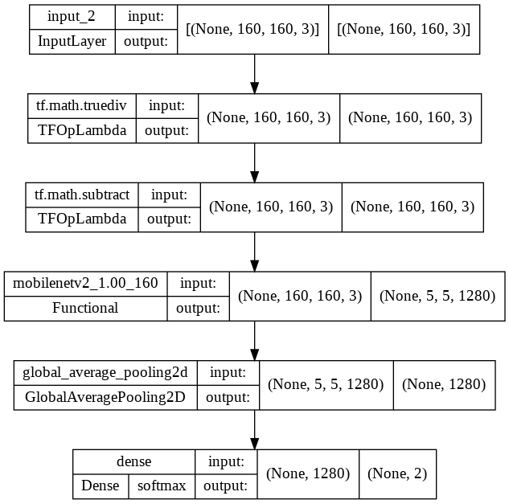

# Concrete Crack Classification using Convolutional Neural Network using MobileNet v2

## 1. Summary
The project's goal is to develop a convolutional neural network model that can accurately detect cracks in concrete. 
The issue is modelled as a binary classification problem (no cracks/negative and cracks/positive). 

## 2. Code and Resources Used
*	This project is created using Google Colab as the main IDE.
*	Main Packages: Numpy, Matplotlib and Tensorflow Keras
*	A dataset of 40000 images was used to train the model (20000 images of concrete in good condition and 20000 images of concrete with cracks). The dataset's source can be accessed [here](https://data.mendeley.com/datasets/5y9wdsg2zt/2).

## 3. Methodology
This project's technique is based on documentation found on the official TensorFlow website. 
You can refer to it [here](https://www.tensorflow.org/tutorials/images/transfer_learning).
### 3.1. Data Pipeline
The image data is loaded, along with the labels that follows the labels. The data is split into train-validation-test sets, with a ratio of 70:24:6. 
No data augmentation is applied as the data size and variation are already sufficient.

### 3.2. Model Pipeline
The input layer is set up to accept colored pictures with a size of 160x160 pixels. The final form will be (160,160,3).

The deep learning model for this project is built via transfer learning. To begin, a preprocessing layer is established, which modifies the pixel values of input images to a range of -1 to 1. 
This layer acts as a feature scaler and is necessary for the transfer learning model to output the correct signals.

MobileNet v2 pretrained model is applied for the feature extractor. The model is included in the TensorFlow Keras package and is pretrained using ImageNet parameters. 
It's also frozen, so it won't update while the model is being trained.

Before generate softmax signals, a global average pooling and dense layer classifier are been used. The softmax signals are used to identify the predicted class.

The model is shown in the figure below.

The model is trained with a batch size of 50 and for 5 epochs. The training accuracy achieved 99% and the validation accuracy of 99%. The two figures below show the graph of the training process.

 

## 4. Results
The model is evaluated with the test data. The loss and accuracy are shown in figure below.

